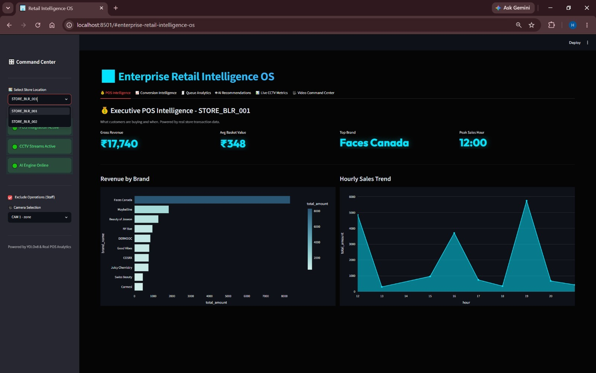
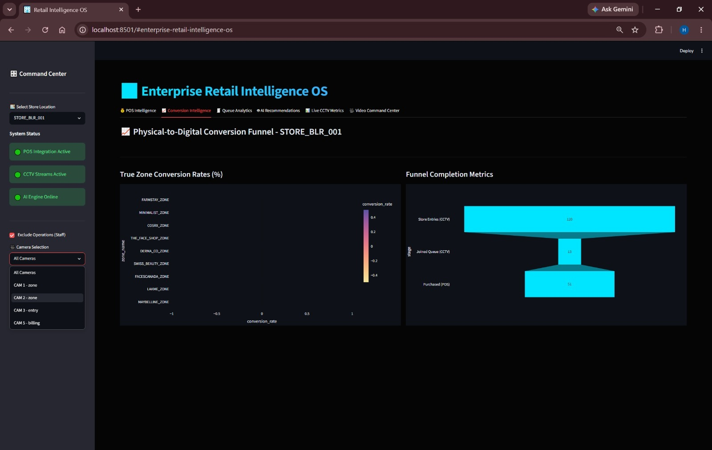
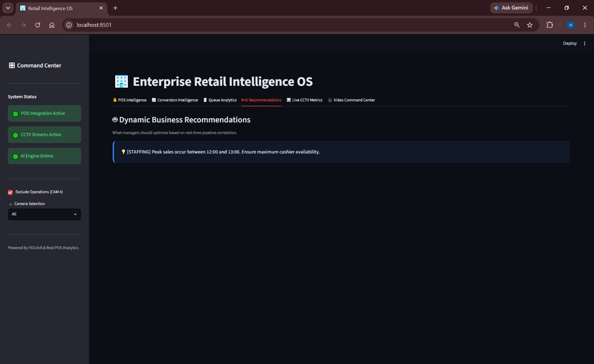
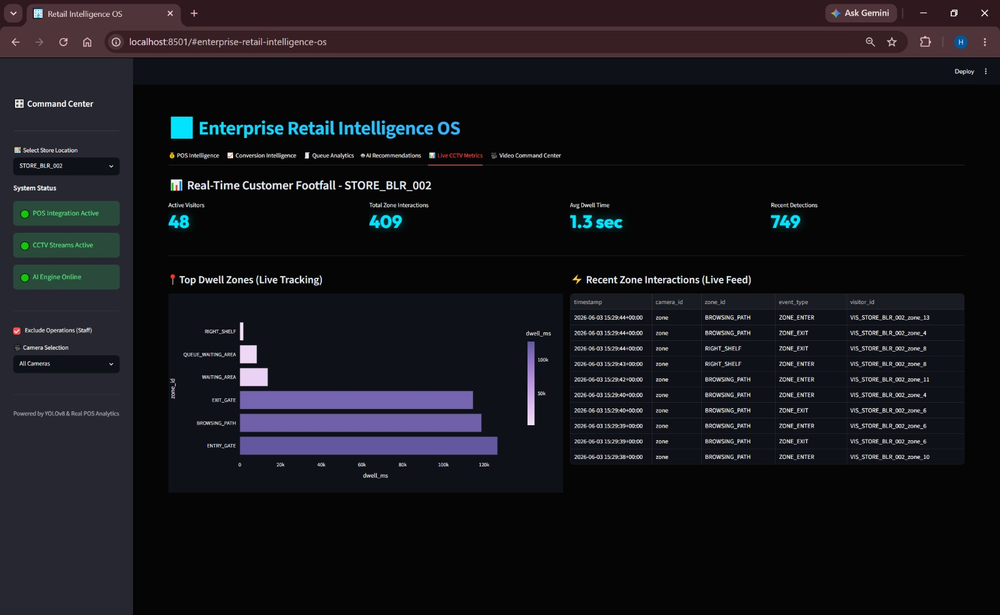
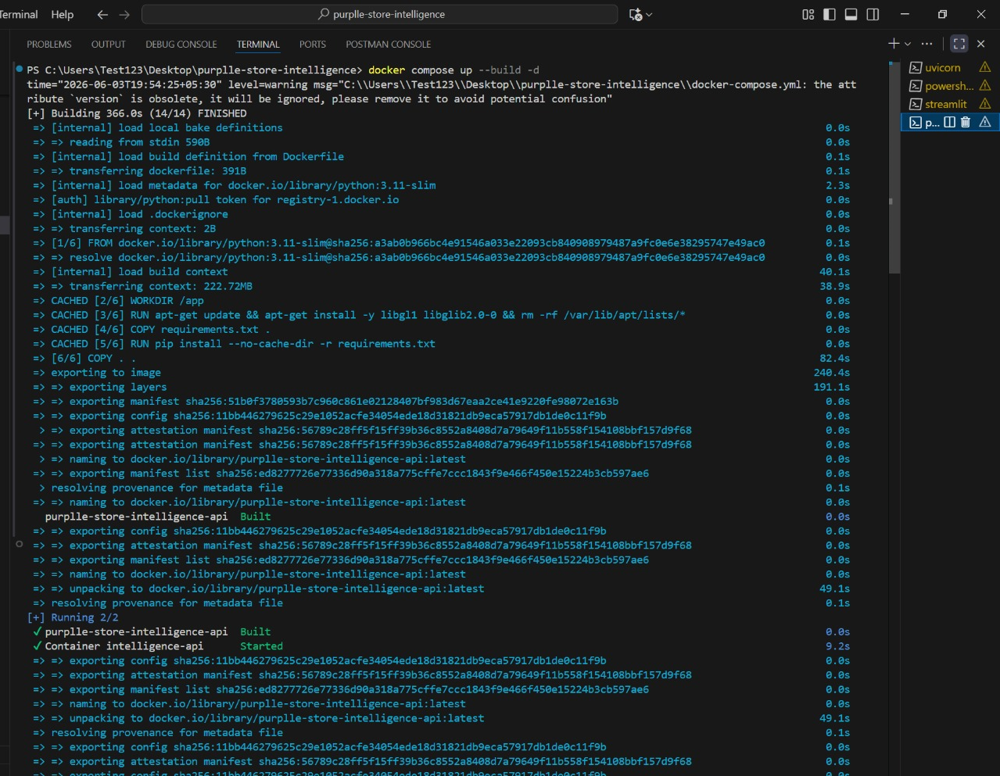

# 🏬 Apex Retail Conversion Intelligence

> **A production-ready AI Retail Intelligence Platform built for real-world deployment.**

> **🔗 Important Links:**
> * [Download Raw Video Datasets Here (Google Drive)](https://drive.google.com/file/d/1fSOp4D1yj_HiN2nlt83y-zLKo17HiwQk/view?usp=sharing)


## 1. Project Overview

## 🚀 Platform Preview



A specialty retail chain—Apex Retail—operates 40 physical stores across 8 cities. While their online channels enjoy mature, real-time analytics (session tracking, bounce rates, conversion drop-offs), their physical stores represent a complete data blind spot.

This platform bridges that gap by transforming raw, unstructured CCTV footage into a highly structured **Real-Time Store Analytics** engine. By combining advanced computer vision models with an enterprise-grade ingestion API, this system provides **Customer Behavior Intelligence** and **AI-Powered Retail Operations**—enabling physical retail to operate with the exact same data fidelity as an e-commerce website.

---

## 2. Architecture Flow Diagram

Our system employs a strictly decoupled, micro-architecture design to ensure massive scalability and real-time inference:

```text
🎥 Raw CCTV Clips (Unstructured Video)
       ↓
👁️ YOLOv8 + ByteTrack Detection Pipeline (pipeline/)
       ↓
📦 Structured Event Stream (Idempotent JSON Payloads)
       ↓
⚡ FastAPI Intelligence Layer (app/)
       ↓
🗄️ Operational Analytics Store (store_analytics.db)
       ↓
📊 Enterprise Streamlit Dashboard (dashboard/)
```
- **Detection Pipeline:** Ingests video, detects and tracks human subjects across multiple zones, calculates dwell times, and securely emits structured data without retaining PII.
- **Intelligence API:** Handles high-throughput event batches, guarantees idempotency, and calculates live funnels.
- **Live Dashboard:** Fetches the aggregated analytics to provide operational command-center views.

---

## 3. Tech Stack

This platform is engineered using a modern, robust AI engineering stack:

- 🐍 **Python 3.11** - Core backend and scripting logic.
- 🎯 **YOLOv8 (nano)** - Highly optimized object detection model.
- 🔄 **ByteTrack** - State-of-the-art multi-object tracking.
- 👁️ **OpenCV** - Video frame ingestion and geometric polygon rendering.
- 🚀 **FastAPI** - High-performance asynchronous REST API framework.
- 📈 **Streamlit** - Rapid UI framework for the Enterprise Dashboard.
- 🗄️ **SQLite** - Embedded operational data store.
- 🐳 **Docker / Docker Compose** - Containerized, reproducible deployment.
- 📊 **Plotly & Pandas** - Data manipulation and charting logic.
- 🧪 **Pytest** - Automated correctness and edge-case testing suite.

---

## 4. Key Features

- **Multi-store federation analytics:** Manage `STORE_BLR_001`, `STORE_BLR_002`, and beyond from a single pane of glass.
- **Multi-camera customer tracking:** Smooth handoffs and unified presence detection across independent camera feeds.
- **Zone-based engagement analytics:** Pinpoint exactly which aisles drive attention.
- **Queue intelligence:** Real-time billing depth monitoring and abandonment alerts.
- **POS-to-CCTV conversion correlation:** Stitching offline sales from `pos_transactions.csv` to visual sessions.
- **Heatmap analytics:** Floorplan intensity matrices based on dwell calculations.
- **Re-entry detection:** Preventing session inflation for customers re-entering.
- **Staff exclusion logic:** Differentiating employees to keep customer metrics pure.
- **Real-time retail KPIs:** Live conversion rates, dwell averages, and store funnels per location.
- **AI-generated operational recommendations:** Automated insights mapping to actions.
- **Dockerized deployment:** Launch the entire backend in one command.

---

## 5. Repository Structure

```text
store-intelligence/
├── app/          # The FastAPI Intelligence Layer (modular routing, db models)
├── pipeline/     # The YOLOv8 Detection Engine (dynamic zone scaling, events)
├── dashboard/    # The Streamlit Command Center (multi-store selection, KPIs)
├── tests/        # The Pytest Suite (covering API, metrics, pipeline)
├── docs/         # Architectural documentation
└── data/         # Official datasets
    ├── layouts/  # Store floorplan mappings
    ├── pos/      # pos_transactions.csv
    └── videos/   # Multi-store subdirectories (STORE_BLR_001, STORE_BLR_002)
```

---

## 6. API Endpoint Reference

| Endpoint | Method | Description |
|----------|:------:|-------------|
| `/events/ingest` | **POST** | Idempotent batch ingestion of YOLO detection events. |
| `/stores/{id}/metrics` | **GET** | Real-time KPIs (unique visitors, conversion %, avg dwell). |
| `/stores/{id}/funnel` | **GET** | Stage-by-stage session dropoff analytics. |
| `/stores/{id}/heatmap` | **GET** | 0-100 normalized zone intensity metrics. |
| `/stores/{id}/anomalies` | **GET** | Live alerts (Queue depth spikes, conversion drops). |
| `/health` | **GET** | Service heartbeat and `STALE_FEED` detection. |

---

## 7. Enterprise Dashboard

The repository includes a production-grade Streamlit application that pulls directly from the Intelligence API, acting as a live command center for store managers:

The dashboard updates dynamically in real time as CCTV events stream through the FastAPI ingestion layer.

- **POS Intelligence:** Correlates real transactions to detect average basket sizes against foot traffic.
- **Conversion Intelligence:** Live funnels matching entry to billing queue to purchase.
- **Queue Analytics:** Monitors billing depth and flags abandonment thresholds.
- **CCTV Command Center:** Provides a clean live feed of the store cameras synchronized with the real-time detection event stream.
- **AI Recommendations:** Highlights automated insights (e.g., "Assign staff to Billing immediately").








---

## 8. Production Readiness

This system was built with the operational realities of a 40-store deployment in mind:
- **Docker Support:** Fully containerized backend requiring zero host dependencies.
- **Structured Logging:** All API requests emit JSON-formatted logs with `trace_id` and `latency_ms`.
- **Idempotent Ingestion:** Safe against network retries; identical payloads will never double-count.
- **Modular Architecture:** The API is split cleanly into `funnel.py`, `metrics.py`, etc., preventing monolithic rot.
- **Graceful API Degradation:** Database timeouts throw clean `HTTP 503` errors instead of raw stack traces.
- **Test Suite:** Automated CI-ready tests covering standard paths and mathematical edges.

---

## 9. Testing & Validation

The test suite validates logic correctness, idempotency, and critical operational edge cases:

```bash
# Run the test suite natively
pytest tests/ -v
```

### Latest Test Results

```bash
8 passed in 1.17s
```

**Validated Capabilities:**
- Safe handling of empty stores (avoiding divide-by-zero).
- Guaranteed exclusion of staff objects (`is_staff=True`) from customer funnels.
- Funnel computations strictly on zero-purchase scenarios.
- Strict payload insertion logic verifying duplicate UUIDs are ignored.

---

## 10. Documentation

Please refer to our extended technical documentation:
- 📖 [**docs/DESIGN.md**](docs/DESIGN.md): The high-level system architecture and how AI heavily assisted the structural layout.
- 📖 [**docs/CHOICES.md**](docs/CHOICES.md): Our explicit reasoning behind YOLOv8, ByteTrack, SQLite, and the JSON payload schema.
- 📖 [**docs/API.md**](docs/API.md): Detailed specifications on the micro-routing modules and REST payload structures.

---

## 11. Execution Flow & Setup

### Requirements
- Python 3.11+
- Docker Engine & Docker Compose

### Step-by-Step Execution

**1. Start the Docker Services (Intelligence API)**
```bash
docker compose up --build -d
```
*API is now alive at `http://localhost:8000`. Swagger UI at `/docs`.*

### Health Check Example

```bash
curl http://localhost:8000/health
```

```json
{
  "status": "HEALTHY"
}
```

**2. Setup Local Python Environment (for Pipeline/Dashboard)**
```bash
python -m venv venv

# Windows
venv\Scripts\activate

# Linux/macOS
source venv/bin/activate

pip install -r requirements.txt
```

**3. Run the Detection Pipeline & POS Analytics**
*This will automatically iterate through all official stores and cameras in `data/videos/` and ingest `data/pos/pos_transactions.csv`.*
```bash
python -m pipeline.event_generator
python app/pos_analytics.py
```
*(Alternatively, use `bash pipeline/run.sh`)*

**4. Query the FastAPI Server**
*You can live-query the API directly while the video processes or use the Swagger UI.*
```bash
# Example manual query:
curl http://localhost:8000/stores/STORE_BLR_002/metrics
```

**5. Launch the Streamlit Dashboard**
*Visualize the metrics in real time by launching the UI.*
```bash
streamlit run dashboard/dashboard.py
```
*Dashboard will automatically open at `http://localhost:8501`.*

---

## Event Log Export

To comply with the official challenge deliverables, the pipeline features an export layer that maps internal database events into the official `sample_events.jsonl` schema.

You can run the export script via:
```bash
python -m pipeline.export_logs
```

If you are running via Docker:
```bash
docker compose exec api python -m pipeline.export_logs
```

The resulting schema-compliant log file will be generated at:
`data/events/final_events.jsonl`

---

## 12. Scalability & Future Work

Future production upgrades could include:

* Kafka-based event streaming
* PostgreSQL or ClickHouse migration
* GPU inference acceleration
* Multi-store federation analytics
* Redis-backed real-time caching
* RTSP live camera ingestion
* Kubernetes deployment orchestration

The current architecture was intentionally designed in a modular and service-oriented manner to support these production-scale extensions.
